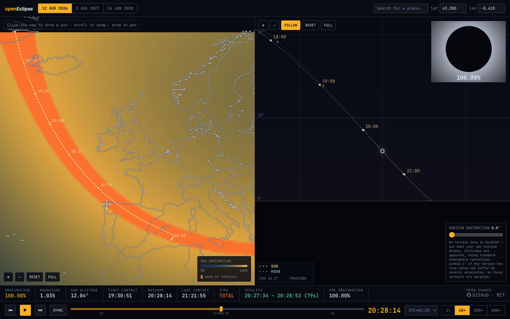

# openEclipse

openEclipse is a self-contained browser app for simulating solar eclipses. It pairs a
world map of maximum obscuration and the path of totality with a simulated sky view for
any observing site, and lets you scrub through the whole event on a timeline.

## Features

- Three eclipses: 12 Aug 2026, 2 Aug 2027, and 26 Jan 2028.
- Map pane with the obscuration field, the path of totality, and a pin you can drop
  anywhere — or set by latitude/longitude, or pick from a preset list of places.
- Sky pane showing the Sun and Moon and their tracks, with a horizon-obstruction slider
  for whatever your own skyline blocks.
- Live readouts for obscuration, magnitude, Sun altitude, contact times, eclipse type,
  and totality duration.
- Timeline scrubbing with play/pause, jump to start or maximum, selectable time zone,
  and 1×–600× playback. Clicking a contact time seeks the timeline to that moment.

## How it works

The Sun and Moon ephemeris is precomputed and embedded; the topocentric geometry,
disc overlap, and contact times are solved live in the browser for your exact
coordinates. [HOW-IT-WORKS.md](HOW-IT-WORKS.md) documents the calculations, the data
encoding, and the accuracy limits.

## Usage

Open the live app at <https://stochastropy.com/openeclipse/>.

Or open `index.html` in a modern browser. There is no build step, package install, or
local server required.

## Project Structure

- `index.html` contains the app, styles, ephemeris calculations, and rendering.
- `HOW-IT-WORKS.md` documents how the eclipse calculations work.
- `assets/screenshot.png` is the screenshot used in this README.

## License

MIT — see [LICENSE](LICENSE). Free to use, modify, and redistribute.

## Contact

<kevinzhang230@hotmail.com>
